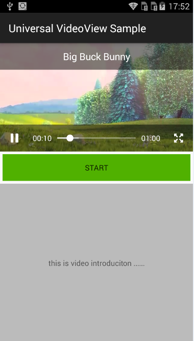
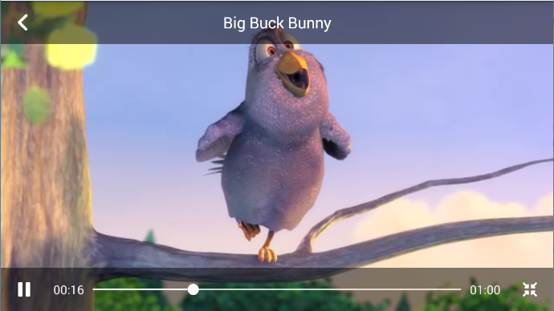

# Android UniversalVideoView

UniversalVideoView is a Android widget helps playing video easier, which is similar with the Android system native `VideoView`,
but with more Media Controller customization.

# Usage

*For a working implementation of this project see the sample app.*

  1. Download the library source and refer it as a library project.

  2. Include the `UniversalVideoView` and  `UniversalMediaController` widget in your layout. This should usually be placed
     in the same parent `ViewGroup`, which makes sense when in full screen state.

            <FrameLayout
                android:id="@+id/video_layout"
                android:layout_width="fill_parent"
                android:layout_height="200dp"
                android:background="@android:color/black">

                <com.universalvideoview.UniversalVideoView
                    android:id="@+id/videoView"
                    android:layout_width="fill_parent"
                    android:layout_height="fill_parent"
                    android:layout_gravity="center"
                    app:uvv_fitXY="false" />

                <com.universalvideoview.UniversalMediaController
                    android:id="@+id/media_controller"
                    android:layout_width="fill_parent"
                    android:layout_height="fill_parent"
                    app:uvv_scalable="true" />

            </FrameLayout>

  3. In your `onCreate` method, set the `UniversalMediaController` to the `UniversalVideoView` and implements the `UniversalVideoView.VideoViewCallback` Callback.

            View mBottomLayout;
            View mVideoLayout;
            UniversalVideoView mVideoView;
            UniversalMediaController mMediaController;

            mVideoView = (UniversalVideoView) findViewById(R.id.videoView);
            mMediaController = (UniversalMediaController) findViewById(R.id.media_controller);
            mVideoView.setMediaController(mMediaController);

            mVideoView.setVideoViewCallback(new UniversalVideoView.VideoViewCallback() {
                @Override
                public void onScaleChange(boolean isFullscreen) {
                    this.isFullscreen = isFullscreen;
                    if (isFullscreen) {
                        ViewGroup.LayoutParams layoutParams = mVideoLayout.getLayoutParams();
                        layoutParams.width = ViewGroup.LayoutParams.MATCH_PARENT;
                        layoutParams.height = ViewGroup.LayoutParams.MATCH_PARENT;
                        mVideoLayout.setLayoutParams(layoutParams);
                        //GONE the unconcerned views to leave room for video and controller
                        mBottomLayout.setVisibility(View.GONE);
                    } else {
                        ViewGroup.LayoutParams layoutParams = mVideoLayout.getLayoutParams();
                        layoutParams.width = ViewGroup.LayoutParams.MATCH_PARENT;
                        layoutParams.height = this.cachedHeight;
                        mVideoLayout.setLayoutParams(layoutParams);
                        mBottomLayout.setVisibility(View.VISIBLE);
                    }
                }

                @Override
                public void onPause(MediaPlayer mediaPlayer) { // Video pause
                    Log.d(TAG, "onPause UniversalVideoView callback");
                }

                @Override
                public void onStart(MediaPlayer mediaPlayer) { // Video start/resume to play
                    Log.d(TAG, "onStart UniversalVideoView callback");
                }

                @Override
                public void onBufferingStart(MediaPlayer mediaPlayer) {// steam start loading
                    Log.d(TAG, "onBufferingStart UniversalVideoView callback");
                }

                @Override
                public void onBufferingEnd(MediaPlayer mediaPlayer) {// steam end loading
                    Log.d(TAG, "onBufferingEnd UniversalVideoView callback");
                }

            });

##Note

  * Support Android Gingerbread V2.3(API Level 9 and above).
  * UniversalVideoView does not retain its full state when going into the background.
    You should save or restore the state and take care of the [Activity Lifecycle](http://developer.android.com/intl/ko/guide/components/activities.html#Lifecycle).
  * You may need to set the `android:configChanges="orientation|keyboardHidden|screenSize"` for your `Activity` in `AndroidManifest.xml`
    to prevent the system from recreate the Activity while phone rotation.

# Customization

 * `uvv_fitXY` attribute for `UniversalVideoView`, Video scale to fill the VideoView's dimension or keep Aspect Ratio (default) likes Android framework VideoView.
 * `uvv_scalable` attribute for `UniversalMediaController`, show or hide the scale button. if you will not play the video in fullscreen.

# TODO
 * Brightness control on `UniversalMediaController`.
 * Volume Control on `UniversalMediaController`.
 * Auto switch to full screen on landscape mode.

# Developed By

 * Andy Ke - <dictfb@gmail.com>

# License

    Copyright 2015 Andy Ke

    Licensed under the Apache License, Version 2.0 (the "License");
    you may not use this file except in compliance with the License.
    You may obtain a copy of the License at

       http://www.apache.org/licenses/LICENSE-2.0

    Unless required by applicable law or agreed to in writing, software
    distributed under the License is distributed on an "AS IS" BASIS,
    WITHOUT WARRANTIES OR CONDITIONS OF ANY KIND, either express or implied.
    See the License for the specific language governing permissions and
    limitations under the License.
